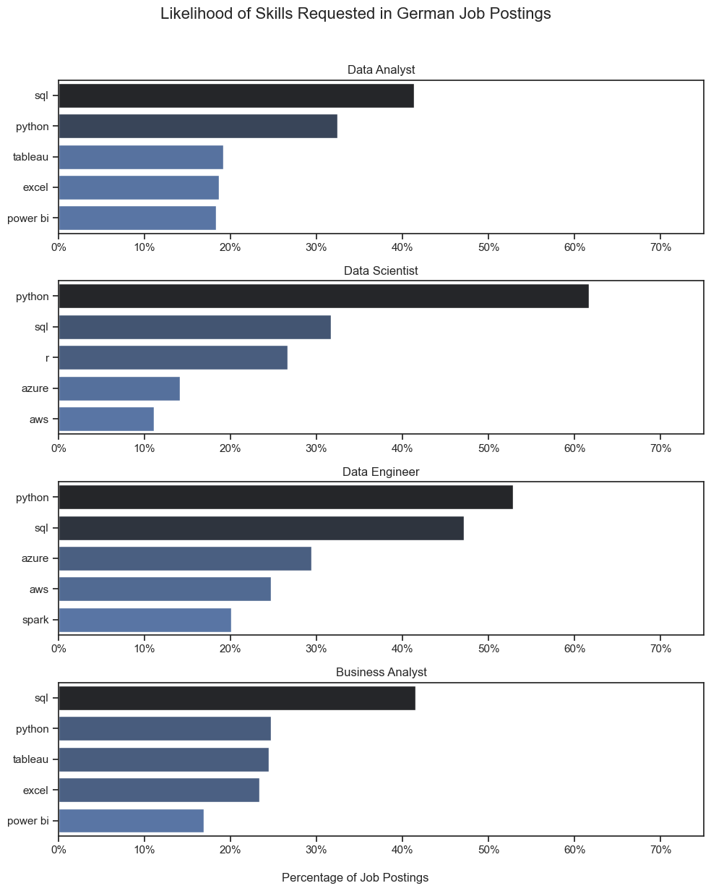
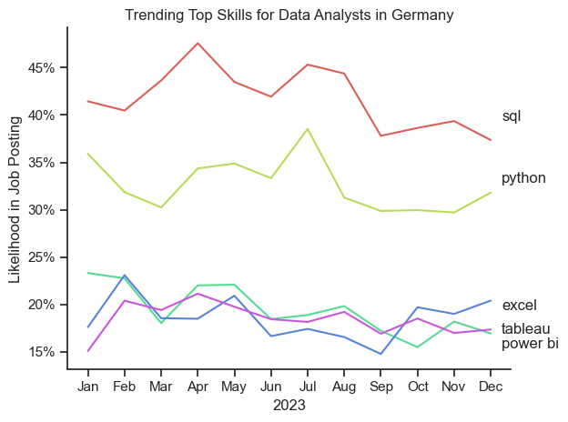
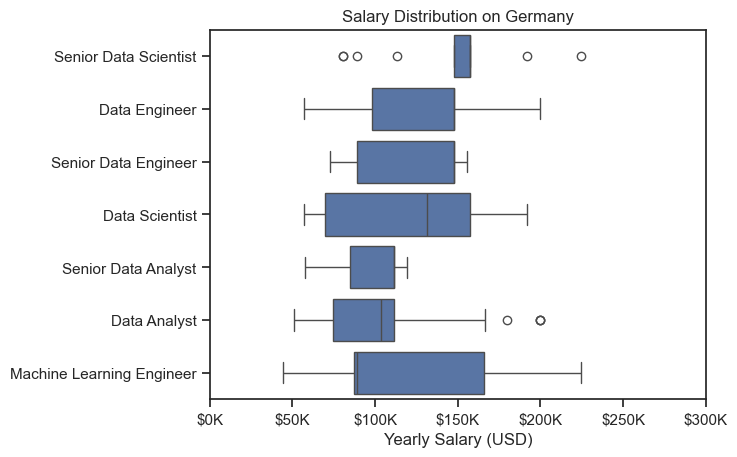
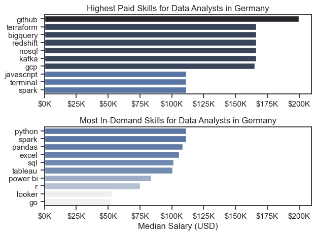

# Overview

Welcome to my analysis of the data job market, focusing on data analyst roles. This project was created out of a desire to navigate and understand the job market more effectively. It delves into the top-paying and in-demand skills to help find optimal job opportunities for data analysts.

The data sourced from [Luke Barousse's Python Course](https://lukebarousse.com/python) which provides a foundation for my analysis, containing detailed information on job titles, salaries, locations, and essential skills. Through a series of Python scripts, I explore key questions such as the most demanded skills, salary trends, and the intersection of demand and salary in data analytics.

# The Questions

Below are the questions I want to answer in my project:

1. What are the skills most in demand for the top 4 most popular data roles?
2. How are in-demand skills trending for Data Analysts?
3. How well paid one of the most popular roles in German postings? How well do jobs and skills pay for Data Analysts? 
4. What are the optimal skills for data analysts to learn? (High Demand AND High Paying) 

# Tools I Used

For my deep dive into the data analyst job market, I harnessed the power of several key tools:

- **Python:** The backbone of my analysis, allowing me to analyze the data and find critical insights.I also used the following Python libraries:
    - **Pandas Library:** This was used to analyze the data. 
    - **Matplotlib Library:** I visualized the data.
    - **Seaborn Library:** Helped me create more advanced visuals. 
- **Jupyter Notebooks:** The tool I used to run my Python scripts which let me easily include my notes and analysis.
- **Visual Studio Code:** My go-to for executing my Python scripts.
- **Git & GitHub:** Essential for version control and sharing my Python code and analysis, ensuring collaboration and project tracking.

# Data Preparation and Cleanup

This section outlines the steps taken to prepare the data for analysis, ensuring accuracy and usability.

## Import & Clean Up Data

I start by importing necessary libraries and loading the dataset, followed by initial data cleaning tasks to ensure data quality.

```python
# Importing Libraries
import ast
import pandas as pd
import seaborn as sns
from datasets import load_dataset
import matplotlib.pyplot as plt  

# Loading Data
dataset = load_dataset('lukebarousse/data_jobs')
df = dataset['train'].to_pandas()

# Data Cleanup
df['job_posted_date'] = pd.to_datetime(df['job_posted_date'])
df['job_skills'] = df['job_skills'].apply(lambda x: ast.literal_eval(x) if pd.notna(x) else x)
```
## Filter German Jobs

I often apply filters during this project, narrowing down to roles based in Germany.

```python
df_DE = df[df['job_country'] == 'Germany']
```

# The Analysis

Each Jupyter notebook for this project aimed at investigating specific aspects of the data job market. Here’s how I approached each question:

## 1. What are the most demanded skills for the top 3 most popular data roles?

To find the most demanded skills for the top 3 most popular data roles. I filtered out those positions by which ones were the most popular, and got the top 5 skills for these top 3 roles. This query highlights the most popular job titles and their top skills, showing which skills I should pay attention to depending on the role I'm targeting. 

View my notebook with detailed steps here: [2_Skill_Demand](2_Skill_Demand.ipynb).

### Visualize Data

```python
fig, ax = plt.subplots(len(job_titles), 1, figsize=(10, 12))  

sns.set_theme(style='ticks')

for i, job_title in enumerate(job_titles):
    df_plt = df_skills_perc[df_skills_perc['job_title_short'] == job_title].head(5)
    
    sns.barplot(
        data=df_plt,
        x='skill_percent',
        y='job_skills',
        ax=ax[i],
        hue='skill_count',
        palette='dark:b_r'
    )

plt.show()
```

### Results



*Bar graph visualizing the salary for the top 3 data roles and their top 5 skills associated with each.*

### Insights:

- SQL is the most requested skill for Data Analysts and Business Analyst, with it in almost half the job postings for both roles. For Data Engineers, Python is the most sought-after skill, appearing in over 50% of job postings.
- Data Engineers require more specialized technical skills (AWS, Azure, Spark) compared to Data Analysts and Data Scientists who are expected to be proficient in more general data management and analysis tools. 
- Python is a versatile skill, highly demanded across all three roles, but most prominently for Data Scientists (62%) and Data Engineers (53%).

## 2. How are in-demand skills trending for Data Analysts?

To find how skills are trending in 2023 for Data Analysts, I filtered data analyst positions and grouped the skills by the month of the job postings. This got me the top 5 skills of data analysts by month, showing how popular skills were throughout 2023.

View my notebook with detailed steps here: [3_Skills_Trend](3_Skills_Trend.ipynb).

### Visualize Data

```python
df_plot = df_DA_DE_percent.iloc[:, :5]
sns.lineplot(data=df_plot, dashes=False, palette='hls')

from matplotlib.ticker import PercentFormatter

ax = plt.gca()
ax.yaxis.set_major_formatter(PercentFormatter(decimals=0))

plt.show()
```

### Results

*Bar graph visualizing the trending top skills for data analysts in Germany in 2023.*

### Insights:
- SQL remains the most in-demand skill throughout the year, consistently appearing in over 40% of job postings for Data Analysts in Germany.
- Python is the second most required skill, fluctuating between ~30% to nearly 40%, peaking around June. This indicates continued strong demand but with more variability than SQL.
- Excel shows a slight upward trend toward the end of the year.
- Tableau and Power BI appear to have very similar demand levels, with neither showing strong trends up or down.

## 3. How well do jobs and skills pay for Data Analysts?

To identify the highest-paying roles and skills, I only got jobs in Germany and looked at their median salary. 

View my notebook with detailed steps here: [4_Salary_Analysis](4_Salary_Analysis.ipynb).

#### Visualize Data

```python
sns.boxplot(data=df_DE_top7, x='salary_year_avg', y='job_title_short', order=job_order)

ticks_x = plt.FuncFormatter(lambda y, pos: f'${int(y/1000)}K')
plt.gca().xaxis.set_major_formatter(ticks_x)

plt.show()
```

#### Results 


*Box plot visualizing the salary distributions for the top 7 data job titles.*

### Insights:

- **Senior Data Scientist** roles command the highest median salary among the listed roles, with limited variance, suggesting a consistent and premium compensation level for experienced professionals in this position.
- **Data Scientist** and **Senior Data Engineer** salaries are quite similar in distribution, though Data Scientists show a broader range, indicating varying levels of expertise or company sizes influencing pay.
- Interestingly, **Data Engineers** appear to have a slightly **higher median salary than Senior Data Engineers**, which is likely due to an **anomaly in the data** — possibly caused by a **smaller sample size** for Senior Data Engineers or a few outliers in the Data Engineer category skewing the distribution upward.
- **Machine Learning Engineer** shows a wide salary range, with some of the highest maximum values, but also considerable variability, suggesting that the role may include both mid-level and highly specialized positions.
- **Senior Data Analyst** roles earn noticeably more than **Data Analysts**, but both fall into a lower salary bracket compared to engineering and scientist roles, highlighting the market's valuation of analytical versus technical or modeling skills.
- **Overall**, technical roles such as Machine Learning Engineer, Data Engineer, and Data Scientist show **greater salary variation**, likely due to differences in required tech stacks, company size, or domain expertise.


### Highest Paid & Most Demanded Skills for Data Analysts

Next, I narrowed my analysis and focused only on data analyst roles. I looked at the highest-paid skills and the most in-demand skills. I used two bar charts to showcase these.

#### Visualize Data

```python
fig, ax = plt.subplots(2, 1)  

sns.barplot(data=df_DA_top_pay, x='median', y=df_DA_top_pay.index, hue='median', ax=ax[0], palette='dark:b_r')

sns.barplot(data=df_DA_skills, x='median', y=df_DA_skills.index, hue='median', ax=ax[1], palette='light:b')

plt.show()
```

#### Results 


